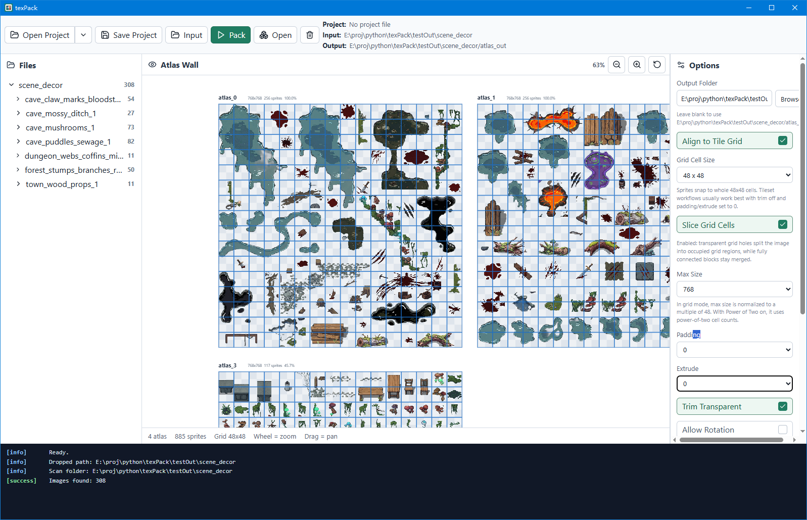

# HollowAtlas

Texture atlas packer for game assets, focused on Godot / TexturePacker-compatible `.tpsheet` output and tileset-friendly packing workflows.

The main implementation is a Rust packing core with a Tauri + React desktop GUI. A legacy Python MVP is also included as a reference implementation and lightweight prototype, but the newest features land in Rust first.



## Features

- Atlas PNG export with shared `atlas.tpsheet` output for single-atlas and multi-atlas packs
- Drag-and-drop desktop GUI with project save/load and recent-project history
- Live atlas preview on a large pan/zoom canvas
- Grid-aligned tileset mode for `48x48` and other fixed cell sizes
- Optional grid slicing mode that keeps the source image as one shape for packing, but exports occupied grid cells as separate tile entries
- Split modes for packing everything together or by first-level folder
- Optional debug JSON export
- Rust and Python automated tests

## Grid-Aligned Tileset Mode

When `Align to Tile Grid` is enabled in the GUI, the packer treats source images as fixed-cell tileset content.

- Images are padded to whole grid-cell multiples when needed
- Rotation is disabled for safety
- The preview can draw the active grid overlay

Two tileset packing behaviors are available:

1. `Slice Grid Cells = Off`
   - Keeps each source image as one sprite
   - Removes only fully transparent outer rows/columns of grid cells
   - Does not reuse transparent holes inside the shape

2. `Slice Grid Cells = On` (default)
   - Scans the image cell-by-cell to find fully transparent cells
   - Packs the source image as one grid shape with holes, instead of shattering it into loose pieces
   - Reuses transparent holes during placement
   - Exports occupied cells as separate tile entries so engines can paint/select them per cell

## Repository Layout

- `src/` - Rust core library and Rust CLI
- `src-tauri/` - Tauri desktop shell
- `ui/` - React + TypeScript frontend
- `scripts/` - helper scripts, including release binary copy
- `tests/` - Rust and Python tests
- `hollowatlas/` - legacy Python implementation and prototype GUI

## Build the Desktop App

Requirements:

- Rust toolchain
- Node.js + npm

Install frontend dependencies:

```powershell
npm install
```

Build the desktop app:

```powershell
npm run tauri:build
```

After a successful build, the Windows executable is copied to the repository root as:

```text
HollowAtlas.exe
```

## Rust CLI

Pack an asset folder:

```powershell
cargo run --bin hollowatlas -- pack E:/path/to/assets E:/path/to/out --max-size 2048 --padding 2 --extrude 1
```

Grid-aligned example:

```powershell
cargo run --bin hollowatlas -- pack E:/path/to/assets E:/path/to/out --align-to-grid --grid-cell-size 48
```

Disable grid slicing while keeping grid alignment:

```powershell
cargo run --bin hollowatlas -- pack E:/path/to/assets E:/path/to/out --align-to-grid --grid-cell-size 48 --no-slice-grid-cells
```

## Python Prototype

The Python prototype is still available for reference:

```powershell
python -m hollowatlas gui
python -m hollowatlas pack E:/path/to/assets E:/path/to/out --max-size 2048 --padding 2 --extrude 1
```

## Tests

Run the main checks:

```powershell
cargo test
cargo test --manifest-path src-tauri/Cargo.toml
npm run build
python -m pytest
```

## Current Status

This project is usable, but still best treated as an alpha/early public release.

- The `.tpsheet` output is designed around the current CodeAndWeb Godot TexturePacker Importer structure
- Grid-aligned tileset workflows are implemented and tested
- More real-world Godot importer validation is still recommended

## License

MIT. See `LICENSE`.
